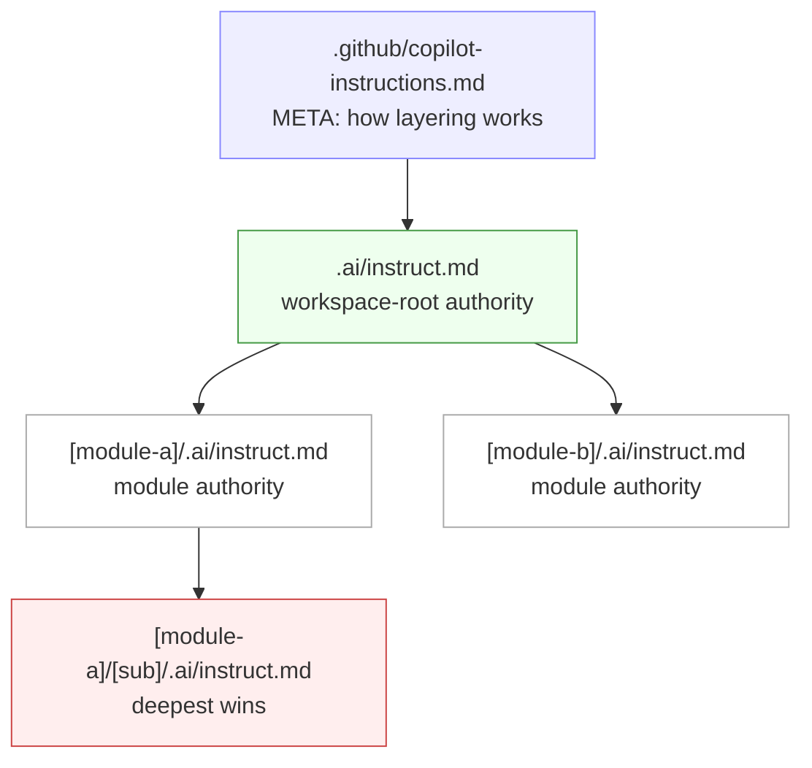
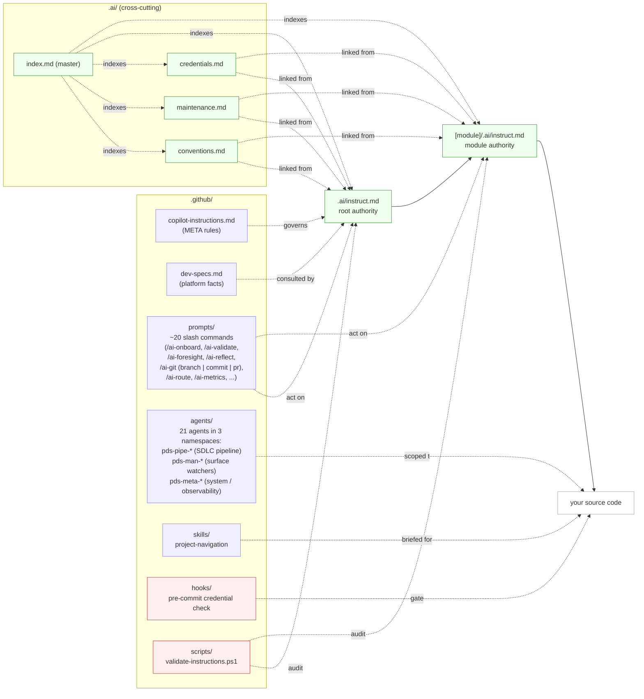
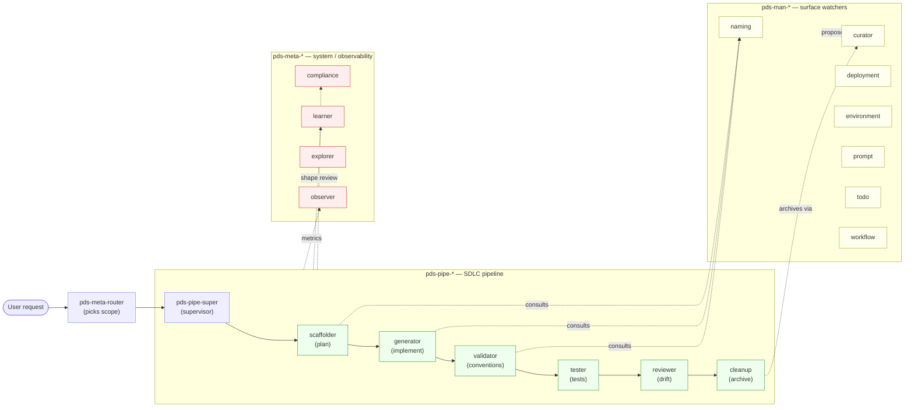

# PDS Layered AI-INSTRUCT Template V5

[](LICENSE)
[](.github/copilot-instructions.md)
[](AGENTS.md)
[](.github/copilot-instructions.md)

> Advanced starter template with **Depth-Priority Hierarchical AI Instructions** for GitHub Copilot Agents, Cursor, Codex, and Aider. Reduces AI hallucinations through per-directory scoped rules where **the deepest file always wins**.

> 📋 **This is the template repository.** After you clone it, run `/ai-onboard` in Copilot Chat — an interactive wizard that asks focused questions, infers safe defaults when unambiguous, and fills template fields (`your-project`, repo URL, `dev-specs.md`, copyright holder, etc.). It then asks you to confirm or edit inferred values. See [TEMPLATE-USAGE.md](TEMPLATE-USAGE.md) for the full adoption path.

## Executive Summary (30 seconds)

- **Who this is for:** teams using Copilot/Cursor/Codex/Aider/Claude Code/Cline/Continue who want a template-first framework for predictable AI behavior across a real multi-folder codebase.
- **Problem solved:** replaces one giant instruction file with scoped, per-directory rules so agents get local context and make fewer wrong edits.
- **Why V5 matters:** depth-priority layering + a 19-agent runtime (router → supervisor → scaffolder → generator → validator → tester → reviewer → cleanup, plus surface watchers and observability) + foresight/heartbeat/self-improvement + governed MCP tools + onboarding prompts + validation/safety conventions makes the system proactive and safer to scale.
- **Deployment-aware:** a [`.deployment/`](.deployment/) hierarchy keys authoritative rules to the active `DEPLOY_MODE` (`dev-local`, `dev-lan`, `prod-railway`, `prod-self-serve`), so dev convenience and prod hardening live in the same repo without conflicting.
- **Adopt incrementally:** see [`.ai/levels.md`](.ai/levels.md) — start at Tier 1 (just scoped instructions) and graduate to pipeline, observability, or autonomy only when you have a concrete pain that justifies the surface area. You are not expected to use all 21 agents on day one.
- **Behavioral evals:** [`.ai/evals/`](.ai/evals/) — declarative YAML evals with a stdlib runner that pin down expected agent behavior (scope resolution, naming-gate consultation, governed-tool wiring) so regressions are caught alongside structural drift.
- **MCP-ready:** [`.ai/mcp/`](.ai/mcp/) — a tool-neutral Model Context Protocol server (Python primary, Node twin) exposes the depth-priority resolver and governed tools to any MCP-aware client.

### Simple diagram for non-technical readers

```text
Project-wide rules (root .ai/instruct.md)
            │
            ▼
Module rules (team/service specific)
            │
            ▼
Folder rules (task/local edge cases)
            │
            ▼
AI applies deepest matching rule
```

---

## Why this template

This project is built on the **Depth-Priority Hierarchical AI-INSTRUCT V5** system: per-directory `.ai/instruct.md` files where **the deepest file always wins**. Coding agents (Copilot, Codex, Cursor, Aider) get the *right* rules at the *right* scope, automatically.



### How the pieces fit together



Read the **vertical** chain (Meta → Root → Module → Code) as authority. Read the **`.ai/` cross-cutting block** as shared rules that any layer can link to without restating. Read **prompts / agents / skills / hooks / scripts** as tools that act on or audit the system.

### The 21-agent runtime

Agents live in [`.github/agents/`](.github/agents/) under three namespaces. They are invocable as Copilot agent modes and as subagents.



- **`pds-pipe-*` (7)** — the SDLC pipeline. `super` orchestrates `scaffolder → generator → validator → tester → reviewer → cleanup` for any task within a resolved scope.
- **`pds-man-*` (7)** — surface watchers that keep the project healthy: `naming` (mandatory consultation before any new identifier), `curator` (keeps `.ai/` in sync with reality), `deployment`, `environment`, `prompt`, `todo`, `workflow`.
- **`pds-meta-*` (5)** — system-level: `router` (gateway), `observer` (metrics digest), `learner` (durable knowledge), `explorer` (read-only Q&A), `compliance` (modularity / shape review).

In this template repository, root authority files intentionally ship with placeholders. After adoption, your filled values become the live authority for your project instance.

What you get out of the box:

- **Layered rules** — global rules in [`.ai/`](.ai/), module-specific overrides per directory, deployment-mode overlays in [`.deployment/<mode>/.ai/`](.deployment/).
- **~13 first-line slash commands** — onboarding (`/ai-onboard`, which also handles existing-project import), maintenance (`/ai-update-index`, `/ai-archive`, `/ai-new-module`), governance (`/ai-validate`, `/ai-audit-registries`, `/ai-env-check`, `/ai-deploy-mode`), version control (`/ai-git` with `branch | commit | pr | status` subcommands), agentic runtime (`/ai-route`, `/ai-foresight`, `/ai-reflect`, `/ai-metrics`).
- **19 specialized agents** in three namespaces: `pds-pipe-*` (`super` → `scaffolder` → `generator` → `validator` → `tester` → `reviewer` → `cleanup`), `pds-man-*` (`naming`, `curator`, `deployment`, `environment`, `prompt`, `todo`, `workflow`), `pds-meta-*` (`router`, `observer`, `learner`, `explorer`, `compliance`). Plus a [`project-navigation`](.github/skills/project-navigation/SKILL.md) skill.
- **Five naming registries** owned by the `pds-man-naming` agent: [`coding-prefixes.md`](.ai/coding-prefixes.md), [`api-conventions.md`](.ai/api-conventions.md), [`database-schema.md`](.ai/database-schema.md), [`error-codes.md`](.ai/error-codes.md), [`config-vars.md`](.ai/config-vars.md). Mandatory consultation before any new artifact is created or renamed.
- **Agentic runtime** — [`agent-config.yaml`](.ai/agent-config.yaml) configures heartbeat, foresight, self-improvement; [`engine/`](.ai/engine/) implements depth-priority resolution; [`agents/tools/`](.ai/agents/tools/) holds governed-tool checklists; [`mcp/`](.ai/mcp/) exposes governed tools over MCP.
- **Deployment-mode awareness** — [`.deployment/`](.deployment/) ships `dev-local`, `dev-lan`, `prod-railway`, `prod-self-serve` scopes; deeper-than-root authority keyed by `DEPLOY_MODE`.
- **Safety built-in** — pre-commit credential block, blocked staged `.env`, archive-first maintenance, never-reset-db, host-vs-container isolation enforced by `pds-man-environment`.
- **Multi-tool ready** — Copilot, Codex (via [AGENTS.md](AGENTS.md)), Cursor (via [`.cursor/rules/`](.cursor/rules/)), Aider, Claude Code (via [CLAUDE.md](CLAUDE.md)), Cline (via [`.clinerules/`](.clinerules/)), Continue (via [`.continue/rules/`](.continue/rules/)).
- **Filled-in examples** — see [`.examples/`](.examples/) for `auth-api` (with real TypeScript code), `data-layer`, and `ui-component` showcases with **before/after** AI behavior.

---

## Best fit / Not fit

### Best fit

- You have a monorepo or modular repo where one global instruction file is too coarse.
- You want a repeatable onboarding flow (`/ai-onboard`) for new contributors.
- You need guardrails for credential safety, archive-first maintenance, and instruction drift checks.

### Not fit

- You only need lightweight prompting for a tiny single-folder prototype.
- Your team does not want to maintain any instruction files beyond one short root note.
- You cannot run basic setup/validation steps during onboarding.

---

## Validation & Status

Add your CI badge(s) here when enabled for your project, for example:
[](https://github.com/vctmasters1/PDS-Layered-AI-Instruct-Template-V5/actions/workflows/ci.yml)

- **Installer checks (`setup.sh` / `setup.ps1`)** install hooks, scaffold `.env`, and run the validator when `pwsh` is available.
- **Safety conventions** include pre-commit credential scanning, blocked staged `.env` files, archive-first maintenance, and never-reset-db guidance.
- **Validation script**: `.github/scripts/validate-instructions.ps1` checks instruction drift, frontmatter sanity, and markdown link integrity.

---

## Realistic before/after walkthrough (text benchmark)

> Synthetic but realistic walkthrough using template examples (no private customer code).

### Scenario A — "Add auth endpoint with role checks"

- **Before (flat instructions):** agent adds route logic directly in controllers, mixes validation, and bypasses repository boundaries.
- **After (V5 layered):** agent follows module-local service/repository split, uses documented auth patterns, and keeps route/service/repository boundaries consistent with [`auth-api` example guidance](.examples/auth-api/.ai/instruct.md).

### Scenario B — "Fix schema migration under deadline"

- **Before (ad-hoc prompting):** agent suggests destructive reset shortcuts.
- **After (V5 layered):** agent follows migration conventions and archive/maintenance rules, avoiding unsafe reset recommendations.

### Scenario C — "Refactor UI component variants"

- **Before (tool-only defaults):** inconsistent naming and props shape across related components.
- **After (V5 layered):** naming and structure align with shared conventions + module overrides, reducing rework in review.

---

## Screenshots / GIFs (placeholder for future media)

Until media is added, use these step-by-step references:

1. **`/ai-onboard` flow:** open Copilot Chat → run `/ai-onboard` → confirm detected stack/platform values → apply generated replacements.
2. **Validation flow:** run `pwsh -NoProfile -File .github/scripts/validate-instructions.ps1` (or `/ai-validate`) → fix flagged drift issues → re-run until clean.
3. **Expected visual assets to add later:** onboarding prompt screenshot, validator pass output screenshot, before/after diff GIF.

Suggested alt text for future media:
- **Alt text:** Copilot Chat showing /ai-onboard questions and detected project defaults
- **Alt text:** Terminal output showing AI-INSTRUCT validator checks passing
- **Alt text:** Side-by-side before/after AI edit behavior with layered instructions enabled

Planned timing: add media after real-world adoption examples are available and sanitized for template-safe sharing.

---

## Comparison: setup choices

| Setup | What you get | Gaps / tradeoffs |
|---|---|---|
| Plain `copilot-instructions.md` only | Quick start, one central policy file | Weak local context in larger repos; more prompt repetition |
| `AGENTS.md` only | Discovery entrypoint for non-Copilot tools | Not a full scoped rule system by itself |
| Cursor-only rules | Strong Cursor integration | Less portable across Copilot/Codex/Aider workflows |
| **Layered AI-INSTRUCT Template V5** | Depth-priority scoped rules + agentic runtime (foresight, heartbeat, governed tools) + prompts + validation + safety conventions | Slightly higher initial setup, but proactive gap detection and better long-term consistency |

---

## Version / Upgrade Notes (V5)

- V5 standardizes depth-priority authority: **deepest matching `instruct.md` wins**.
- V5 introduces the **agentic runtime**: foresight engine, heartbeat alignment, self-improvement loops, and governed MCP tools in `.ai/`.
- V5 formalizes onboarding/maintenance commands (`/ai-onboard`, `/ai-validate`, `/ai-archive`, etc.).
- V5 expands validator coverage and tightens instruction cross-references over prior revisions.
- If upgrading from a flatter setup, start by migrating root rules to `.ai/instruct.md`, then split module-specific rules into local `.ai/instruct.md` files.

---

## Quick Start

```bash
# 1. Clone this template (or click "Use this template" on GitHub)
git clone https://github.com/vctmasters1/PDS-Layered-AI-Instruct-Template-V5.git your-project
cd your-project

# 2. One-shot setup (installs hooks, scaffolds .env, runs validator)
bash setup.sh             # macOS / Linux / WSL / Git Bash
pwsh setup.ps1            # Windows PowerShell

# 3. Open in VS Code with Copilot, then in Copilot Chat:
#       /ai-onboard
#    (interactive wizard asks + infers defaults, fills placeholders including
#     .github/dev-specs.md, then asks you to confirm/edit inferred values)

# 4. Add your project's start commands here once /ai-onboard is done.
```

---

## Project Structure

```
your-project/
├── .github/                     ← AI tooling: instructions, prompts, agents, hooks
│   ├── copilot-instructions.md  ← META: how the .ai/ instruction system works
│   ├── dev-specs.md             ← Template field sheet; filled/confirmed during onboarding
│   ├── prompts/                 ← 13 slash-command prompt files (`/ai-*`)
│   ├── agents/                  ← 19 custom agents (pds-pipe-*, pds-man-*, pds-meta-*)
│   ├── skills/                  ← Domain knowledge skill packs
│   ├── hooks/                   ← Git hook scripts (run install-hooks.sh / .ps1 to activate)
│   ├── workflows/               ← GitHub Actions CI
│   ├── scripts/                 ← validate-instructions.ps1 + helpers
│   ├── todo/                    ← Project-level TODO list
│   ├── debug/                   ← AI-generated debug scripts (gitignored except README)
│   └── tmp/                     ← Ephemeral output files (gitignored except README)
│
├── .ai/                         ← Cross-cutting rules + agentic runtime
│   ├── instruct.md              ← Root authority scaffold (filled during onboarding)
│   ├── index.md                 ← Master index of every instruction section
│   ├── conventions.md           ← Naming and organization rules
│   ├── maintenance.md           ← Archive, never-delete, never-reset-db rules
│   ├── credentials.md           ← Credential warehousing and security rules
│   ├── environment.md           ← Host-vs-container isolation; never silently mutate host
│   ├── agent-config.yaml        ← Heartbeat, foresight, self-improvement, safety knobs
│   ├── heartbeat.md             ← Re-alignment procedure agents run every N steps
│   ├── coding-prefixes.md       ← Naming registry: GUI + code element prefixes
│   ├── api-conventions.md       ← Naming registry: HTTP endpoints
│   ├── database-schema.md       ← Naming registry: tables, columns, indices
│   ├── error-codes.md           ← Naming registry: domain error codes
│   ├── config-vars.md           ← Naming registry: environment / config variables
│   ├── engine/                  ← Resolver (get-effective-instructions.py) + foresight engine + tests
│   ├── agents/                  ← Governed-tool checklists, agent state, run logs
│   ├── mcp/                     ← MCP-side governed tool surface
│   ├── governance/              ← Governance rules (e.g., never-bypass-validator)
│   ├── foresight/  knowledge/  logs/   ← Runtime outputs (gitignored)
│
├── .deployment/                 ← Deployment-mode authority (keyed by DEPLOY_MODE)
│   ├── dev-local/.ai/instruct.md
│   ├── dev-lan/.ai/instruct.md
│   ├── prod-railway/.ai/instruct.md
│   └── prod-self-serve/.ai/instruct.md
│
├── .vscode/                     ← Shared editor/MCP settings (committed)
├── .dev-docs/                   ← Dev notes for the workspace root (index + .old/)
├── .archive/                    ← Retired files, path-mirrored (read-only reference)
├── .example-module/             ← Bare scaffold for a new module
├── .examples/                   ← Filled-in module showcases (auth-api, data-layer, ui-component)
├── .cursor/rules/               ← Cursor pointer rules → .ai/ (no rule duplication)
├── .clinerules/                 ← Cline pointer rules → .ai/
├── .continue/rules/             ← Continue pointer rules → .ai/
│
├── .env.example                 ← Environment variable template (committed)
├── .gitignore
├── AGENTS.md                    ← Discovery anchor for non-Copilot AI agents
├── CLAUDE.md                    ← Pointer for Claude Code
├── CHANGELOG.md
├── CONTRIBUTING.md
├── LICENSE
├── setup.sh / setup.ps1         ← One-shot installer (hooks + .env + validator)
├── TEMPLATE-USAGE.md            ← How to adapt this template to your project
└── README.md                    ← This file
```

---

## Documentation

| Document | Description |
|----------|-------------|
| [.ai/instruct.md](.ai/instruct.md) | Root authority scaffold for adopters (filled during onboarding) |
| [.ai/index.md](.ai/index.md) | Master index of every AI instruction section |
| [.ai/conventions.md](.ai/conventions.md) | Naming and file-organization rules |
| [.ai/maintenance.md](.ai/maintenance.md) | Archive-first, never-delete, never-reset-db |
| [.ai/credentials.md](.ai/credentials.md) | Credential warehousing rules |
| [.ai/environment.md](.ai/environment.md) | Host-vs-container isolation rules |
| [.ai/agent-config.yaml](.ai/agent-config.yaml) | Heartbeat / foresight / safety knobs |
| [.deployment/README.md](.deployment/README.md) | Deployment-mode convention |
| [.github/copilot-instructions.md](.github/copilot-instructions.md) | META: how depth-priority works (Copilot entrypoint) |
| [AGENTS.md](AGENTS.md) | Discovery anchor for Codex / generic AI agents |
| [CLAUDE.md](CLAUDE.md) | Pointer file for Claude Code |
| [TEMPLATE-USAGE.md](TEMPLATE-USAGE.md) | How to adapt this template to your project |
| [CONTRIBUTING.md](CONTRIBUTING.md) | How to contribute safely and consistently |

---

## AI Copilot Quick Reference

This project uses the **Depth-Priority Hierarchical AI-INSTRUCT** system. The authoritative inventory of slash commands, custom agents, and skills lives in [.ai/index.md](.ai/index.md). Run `/ai-onboard` in Copilot Chat on a fresh clone to fill in every placeholder.

### Slash commands (24)

> Featured subset below. Full inventory: [.ai/index.md](.ai/index.md).

| Command | What it does |
|---|---|
| `/ai-onboard` | Interactive wizard: ask, infer, confirm template fields |
| `/ai-update-index` | Rebuild [.ai/index.md](.ai/index.md) after instruction-system changes |
| `/ai-archive` | Archive a file under `.archive/` per the never-delete convention |
| `/ai-new-module` | Scaffold a new module and register it |
| `/ai-validate` | Run the AI-INSTRUCT drift validator |
| `/ai-env-check` | Audit host-vs-container isolation; report only |
| `/ai-foresight` | Anticipate gaps and risks before acting |
| `/ai-reflect` | Post-task reflection; propose `.ai/` improvements |
| `/ai-git` | Version control: `branch` (with scope locking) \| `commit` (date refresh + Conventional Commits) \| `pr` (governance-gated) \| `status` |
| `/ai-route` | Invoke the router to pick scope + next-hop agent |
| `/ai-deploy-mode` | Inspect or switch active `DEPLOY_MODE` |
| `/ai-metrics` | Run the observer over the metrics window |
| `/ai-observe` | Display runtime observability: metrics, logs, cheat sheets |
| `/ai-ports-check` | Validate the port registry against the codebase |
| `/ai-audit-registries` | Audit the five naming registries via `pds-man-naming` Mode 4 |
| `/ai-check-yourself` | Re-read scope rules; reset to baseline if AI has drifted |
| `/ai-autonomous-start` | **Opt-in** — start a bounded autonomous run (disabled by default) |

### Agents (21) at a glance

| Namespace | Agents |
|---|---|
| `pds-pipe-*` (SDLC) | super, scaffolder, generator, validator, tester, reviewer, cleanup |
| `pds-man-*` (surface watchers) | naming, curator, deployment, environment, prompt, todo, workflow, ports, versioncontrol |
| `pds-meta-*` (system) | router, observer, learner, explorer, compliance |

---

## Autonomous layer (opt-in, disabled by default)

This template ships a **lightweight autonomous orchestration layer** under [.ai/autonomous/](.ai/autonomous/). It composes the existing 21 agents under hard ceilings and human-in-the-loop gates — it adds **no new authority and no new agents**, and is **disabled by default**.

- **How to enable**: read [safety-guardrails.md](.ai/autonomous/safety-guardrails.md), [orchestrator.md](.ai/autonomous/orchestrator.md), and [task-queue.md](.ai/autonomous/task-queue.md), then set `enabled: true` in [autonomy-config.yaml](.ai/autonomous/autonomy-config.yaml).
- **Defaults when enabled**: 25 steps, 30 minutes, 20 files modified per run; 1 goal at a time; `human_approval: always`.
- **Forbidden even when enabled**: editing `.ai/instruct.md` / `.ai/governance/` / `.ai/index.md`, writing secrets, force-pushes, schema resets, invoking `pds-man-curator` or `pds-meta-learner`.
- **Slash command**: [`/ai-autonomous-start "<goal>"`](.github/prompts/ai-autonomous-start.prompt.md) — refuses with a pointer message until the master switch is flipped.

See [AGENTS.md](AGENTS.md#autonomous-layer-opt-in-disabled-by-default) for the full enable checklist.

---

## Execution Depth — Reference Implementation

For technical evaluators: the autonomous layer is not just a markdown contract. A small, production-grade reference runner lives at [.ai/autonomous/reference-implementation/](.ai/autonomous/reference-implementation/) and exercises the contract end to end.

- **Pure stdlib Python**, ~600 LOC, zero third-party dependencies — keeps the supply-chain surface minimal.
- **Real orchestration loop**: pre-flight, allowed-agents enforcement, forbidden-write guard, hard ceilings (steps, wall clock, files), `.ai/PAUSE` sentinel, append-only JSONL audit log matching the schema in `autonomy-config.yaml`, last-write-wins queue, goal sanitiser.
- **Simulated agent backend** (clearly marked `[STUB]`): the orchestration is real, the agent calls are deterministic stubs. Production deployments swap one class — `AgentBackend` — to wire in their real PDS agent runtime (Copilot Chat, an MCP server, an internal LLM gateway, etc.).
- **Default human-in-the-loop**: stdin approval before every agent hand-off; every decision (`auto`, `human`, `denied`) is in the audit log.
- **Realistic example**: [`example_workflow.py`](.ai/autonomous/reference-implementation/example_workflow.py) autonomously implements a `feature_module_v1` module — router → supervisor → naming → scaffolder → generator → validator → tester → reviewer — and demonstrates the master-switch refusal and the `.ai/PAUSE` halt path.

Run the demo from the repo root:

```powershell
python .ai/autonomous/reference-implementation/example_workflow.py
```

Read [the reference-implementation README](.ai/autonomous/reference-implementation/README.md) for the full operations guide, exit codes, observable safety controls, and the production-hardening checklist.

---

## License

Proprietary. Copyright (c) 2026 PipeDreamSystemsLLC. All rights reserved.

This software is **not** open source. A limited 30-day personal evaluation grant is provided for individual study or non-commercial academic research; all other use — including any use by an organization, any internal business use, any inclusion in a product, service, dataset, or training corpus, and any redistribution — requires a separate written commercial license from PipeDreamSystemsLLC. See [LICENSE](LICENSE) for the full terms.

For commercial licensing inquiries, contact PipeDreamSystemsLLC.
